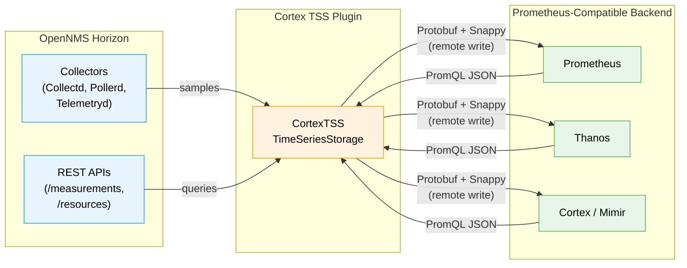
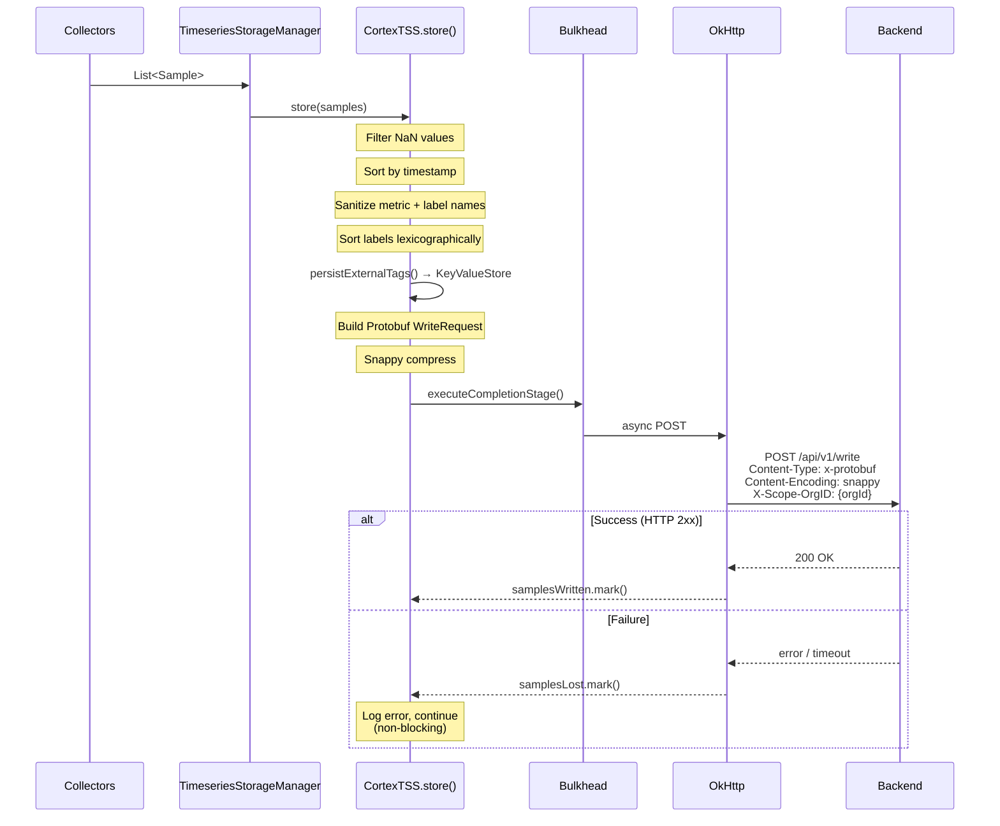
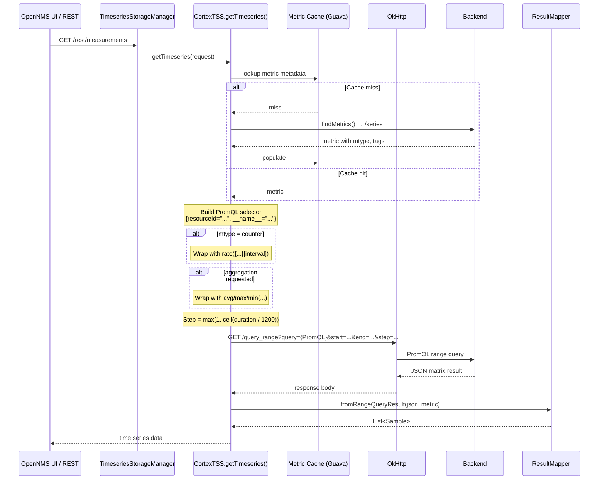
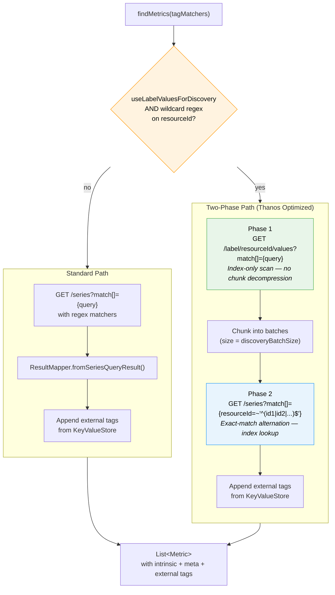
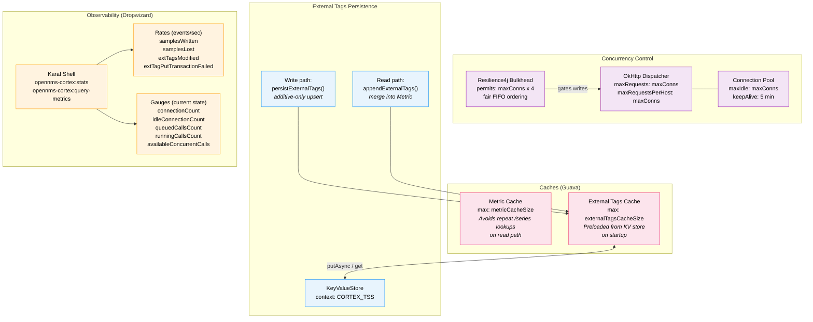
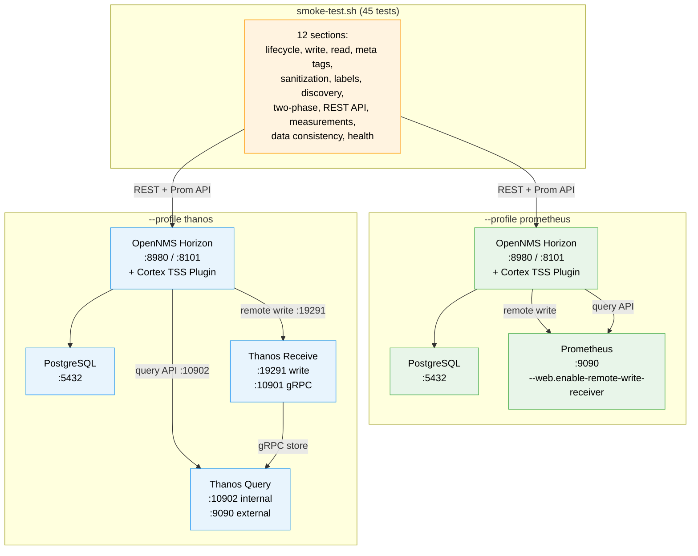

# Cortex TSS Plugin - System Architecture

> Visual architecture of the OpenNMS Cortex TSS Plugin.
> See [PLUGIN-ARCHITECTURE.md](PLUGIN-ARCHITECTURE.md) for detailed documentation.

---

## 1. High-Level Overview

How the plugin fits between OpenNMS and a Prometheus-compatible backend.

---

## 2. Write Path

How a metric sample flows from OpenNMS collectors to the backend.

---

## 3. Read Path

How a measurements query flows from the REST API through to PromQL.

---

## 4. Metric Discovery

How `findMetrics()` routes between the standard path and the Thanos-optimized two-phase path.

---

## 5. Infrastructure

Caching, external tags persistence, concurrency control, and observability.

---

## 6. E2E Test Stack

The Docker/Podman Compose smoke test environment (profiles are mutually exclusive).

---

<strong>Full System Diagram</strong> (click to expand)

All components and connections in a single view.

```mermaid
graph TB
    %% ── OpenNMS Core ──────────────────────────────────────────
    subgraph OpenNMS["OpenNMS Horizon"]
        direction TB
        COLL["Collectd / Pollerd / Telemetryd<br/>(data collectors)"]
        TSM["TimeseriesStorageManager<br/>(strategy=INTEGRATION)"]
        MAPI["Measurements REST API<br/>GET /rest/measurements"]
        RAPI["Resources REST API<br/>GET /rest/resources"]
        KVS["KeyValueStore<br/>(OSGi service)"]

        COLL -->|"List&lt;Sample&gt;"| TSM
        MAPI -->|"TimeSeriesFetchRequest"| TSM
        RAPI -->|"findMetrics()"| TSM
    end

    %% ── Plugin Internals ──────────────────────────────────────
    subgraph Plugin["CortexTSS Plugin (OSGi Bundle)"]
        direction TB

        subgraph WritePath["Write Path"]
            direction TB
            STORE["store(List&lt;Sample&gt;)"]
            FILT["Filter NaN values"]
            SORT["Sort by timestamp"]
            SANW["Sanitize metric &amp;<br/>label names"]
            LBLSORT["Sort labels<br/>lexicographically"]
            PROTO["Build Protobuf<br/>WriteRequest"]
            SNAP["Snappy compress"]
            BULK["Resilience4j Bulkhead<br/>(maxConns x 4 permits)"]
            HTTP_W["OkHttp async POST<br/>Content-Type: x-protobuf<br/>Content-Encoding: snappy<br/>X-Scope-OrgID: orgId"]

            STORE --> FILT --> SORT --> SANW --> LBLSORT --> PROTO --> SNAP --> BULK --> HTTP_W
        end

        subgraph ReadPath["Read Path"]
            direction TB
            GTS["getTimeseries()"]
            MCACHE["Metric Cache<br/>(Guava)"]
            PQBUILD["Build PromQL query"]
            RATE["Wrap rate() if counter"]
            AGG["Wrap avg/max/min<br/>if aggregation"]
            STEPCALC["Step = max(1,<br/>ceil(duration/1200))"]
            HTTP_R["OkHttp GET<br/>/query_range"]
            RMAP["ResultMapper<br/>parse JSON to List&lt;Sample&gt;"]

            GTS --> MCACHE --> PQBUILD --> RATE --> AGG --> STEPCALC --> HTTP_R --> RMAP
        end

        subgraph Discovery["Metric Discovery"]
            direction TB
            FM["findMetrics(TagMatchers)"]
            ROUTE{"useLabelValues<br/>AND wildcard?"}

            subgraph Standard["Standard Path"]
                SER["GET /series?match[]=..."]
                SPAR["ResultMapper<br/>parse series JSON"]
                SER --> SPAR
            end

            subgraph TwoPhase["Two-Phase Path (Thanos Optimized)"]
                direction TB
                PH1["Phase 1: GET /label/resourceId/values<br/>(index-only scan)"]
                PH2["Phase 2: Batch /series queries<br/>regex: ^(id1|id2|...)$<br/>(exact-match index lookup)"]
                PH1 --> PH2
            end

            FM --> ROUTE
            ROUTE -->|no| SER
            ROUTE -->|yes| PH1
        end

        subgraph ExtTags["External Tags"]
            direction TB
            ETCACHE["External Tags Cache<br/>(Guava)"]
            ETPERS["persistExternalTags()"]
            ETAPPEND["appendExternalTags()<br/>(read path)"]
        end

        subgraph Observability["Observability"]
            METRICS["Dropwizard MetricRegistry<br/>samplesWritten | samplesLost<br/>connectionCount | queuedCalls<br/>availableConcurrentCalls"]
            STATS["Karaf: opennms-cortex:stats"]
            MQUERY["Karaf: opennms-cortex:query-metrics"]
        end
    end

    %% ── Backends ──────────────────────────────────────────────
    subgraph Backends["Prometheus-Compatible Backend"]
        direction TB
        subgraph PromStack["Prometheus"]
            PWRITE["POST /api/v1/write<br/>(remote write receiver)"]
            PREAD["GET /api/v1/query_range<br/>GET /api/v1/series<br/>GET /api/v1/label/*/values"]
        end
        subgraph ThanosStack["Thanos"]
            TRECV["Thanos Receive<br/>POST :19291/api/v1/receive"]
            TQUERY["Thanos Query<br/>GET :10902/api/v1/*"]
            TRECV ---|"gRPC :10901"| TQUERY
        end
    end

    %% ── Connections ───────────────────────────────────────────
    TSM -->|"store()"| STORE
    TSM -->|"getTimeseries()"| GTS
    TSM -->|"findMetrics()"| FM

    KVS <-->|"put/get context=CORTEX_TSS"| ETCACHE
    STORE -.->|"persist tags"| ETPERS
    ETPERS --> ETCACHE
    SPAR -.->|"augment metrics"| ETAPPEND
    ETAPPEND --> ETCACHE
    PH2 -.->|"augment metrics"| ETAPPEND

    HTTP_W -->|"Protobuf + Snappy"| PWRITE
    HTTP_W -->|"Protobuf + Snappy"| TRECV
    HTTP_R --> PREAD
    HTTP_R --> TQUERY
    SER --> PREAD
    SER --> TQUERY
    PH1 --> PREAD
    PH1 --> TQUERY
    PH2 --> PREAD
    PH2 --> TQUERY

    RMAP -->|"List&lt;Sample&gt;"| MAPI
    SPAR -->|"List&lt;Metric&gt;"| RAPI
    PH2 -->|"List&lt;Metric&gt;"| RAPI

    HTTP_W -.->|"mark()"| METRICS
    STATS --> METRICS
    MQUERY --> FM

    %% ── Styling ───────────────────────────────────────────────
    classDef core fill:#e8f4fd,stroke:#2196F3,color:#000
    classDef plugin fill:#fff3e0,stroke:#FF9800,color:#000
    classDef backend fill:#e8f5e9,stroke:#4CAF50,color:#000
    classDef cache fill:#fce4ec,stroke:#E91E63,color:#000

    class COLL,TSM,MAPI,RAPI,KVS core
    class STORE,FILT,SORT,PROTO,SANW,LBLSORT,SNAP,BULK,HTTP_W,GTS,PQBUILD,RATE,AGG,STEPCALC,HTTP_R,RMAP,FM,ROUTE,SER,SPAR,PH1,PH2,ETPERS,ETAPPEND,METRICS,STATS,MQUERY plugin
    class PWRITE,PREAD,TRECV,TQUERY backend
    class MCACHE,ETCACHE cache
```

