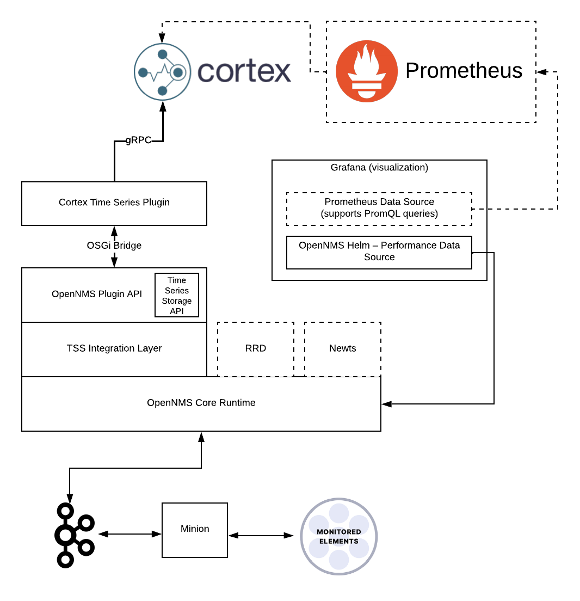

# OpenNMS Prometheus RemoteWrite Plugin [](https://dl.circleci.com/status-badge/redirect/gh/OpenNMS-Plugins/opennms-cortex-tss-plugin/tree/master)

This plugin exposes an implementation of the [TimeSeriesStorage](https://github.com/OpenNMS/opennms-integration-api/blob/v0.4.1/api/src/main/java/org/opennms/integration/api/v1/timeseries/TimeSeriesStorage.java#L40) interface that converts metrics to a Prometheus model and delegates writes & reads via the Prometheus `remote_write` / `remote_read` protocol to any compatible backend (e.g. [Cortex](https://cortexmetrics.io/), Mimir, Thanos, VictoriaMetrics, Prometheus itself).

> **Note:** This plugin was previously published as `opennms-cortex-tss-plugin`. It has been renamed to reflect that it works with any Prometheus `remote_write`-compatible backend, not just Cortex. The OSGi configuration PID (`org.opennms.plugins.tss.cortex`) and Java packages are unchanged for backward compatibility with existing deployments.



## Usage

Start a Prometheus `remote_write`-compatible backend. For Cortex, see https://cortexmetrics.io/docs/getting-started/

You can also download:

https://github.com/opennms-forge/stack-play/tree/master/standalone-cortex-minimal

and start with
`docker-compose up`

Build and install the plugin into your local Maven repository using:
```
mvn clean install
```

Enable the TSS and configure:
```
echo 'org.opennms.timeseries.strategy=integration
org.opennms.timeseries.tin.metatags.tag.node=${node:label}
org.opennms.timeseries.tin.metatags.tag.location=${node:location}
org.opennms.timeseries.tin.metatags.tag.geohash=${node:geohash}
org.opennms.timeseries.tin.metatags.tag.ifDescr=${interface:if-description}' >> ${OPENNMS_HOME}/etc/opennms.properties.d/cortex.properties
```

From the OpenNMS Karaf shell:
```
feature:repo-add mvn:org.opennms.plugins.timeseries/prometheus-remotewrite-karaf-features/1.0.0-SNAPSHOT/xml
feature:install opennms-plugins-prometheus-remotewrite
```

Configure (you can omit that if you use the default values). The configuration PID is unchanged from the previous `opennms-cortex-tss-plugin` release so existing deployments keep working:
```
config:edit org.opennms.plugins.tss.cortex

property-set writeUrl http://localhost:9009/api/prom/push
property-set readUrl http://localhost:9009/prometheus/api/v1
property-set maxConcurrentHttpConnections 100
property-set writeTimeoutInMs 1000
property-set readTimeoutInMs 1000
property-set metricCacheSize 1000
property-set externalTagsCacheSize 1000
property-set bulkheadMaxWaitDurationInMs 9223372036854775807

config:update
```

Update automatically:
```
bundle:watch *
```

## Backend tips (Cortex example)

### View the ring

http://localhost:9009/ring

### View internal metrics

http://localhost:9009/metrics
