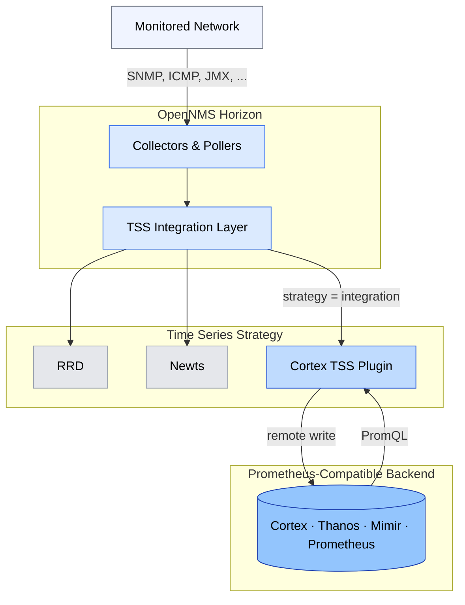

# OpenNMS Cortex Plugin [](https://circleci.com/gh/OpenNMS/opennms-cortex-tss-plugin)

This plugin exposes an implementation of the [TimeSeriesStorage](https://github.com/OpenNMS/opennms-integration-api/blob/v0.4.1/api/src/main/java/org/opennms/integration/api/v1/timeseries/TimeSeriesStorage.java#L40) interface that converts metrics to a Prometheus model and delegates writes & reads to any Prometheus-compatible backend ([Cortex](https://cortexmetrics.io/), [Thanos](https://thanos.io/), [Mimir](https://grafana.com/oss/mimir/), or vanilla [Prometheus](https://prometheus.io/)).



For detailed architecture documentation including write/read path internals, concurrency model, and configuration reference, see [PLUGIN-ARCHITECTURE.md](PLUGIN-ARCHITECTURE.md) and [MERMAID.md](MERMAID.md).

## Usage

Start Cortex - see https://cortexmetrics.io/docs/getting-started/

You can also download:

https://github.com/opennms-forge/stack-play/tree/master/standalone-cortex-minimal

and start with
`docker-compose up`

Build and install the plugin into your local Maven repository using:
```
mvn clean install
```

Enable the TSS and configure:
```
echo 'org.opennms.timeseries.strategy=integration
org.opennms.timeseries.tin.metatags.tag.node=${node:label}
org.opennms.timeseries.tin.metatags.tag.location=${node:location}
org.opennms.timeseries.tin.metatags.tag.geohash=${node:geohash}
org.opennms.timeseries.tin.metatags.tag.ifDescr=${interface:if-description}' >> ${OPENNMS_HOME}/etc/opennms.properties.d/cortex.properties
```

From the OpenNMS Karaf shell:
```
feature:repo-add mvn:org.opennms.plugins.timeseries/cortex-karaf-features/1.0.0-SNAPSHOT/xml
feature:install opennms-plugins-cortex-tss
```

Configure (you can omit that if you use the default values):
```
config:edit org.opennms.plugins.tss.cortex

property-set writeUrl http://localhost:9009/api/prom/push
property-set readUrl http://localhost:9009/prometheus/api/v1
property-set maxConcurrentHttpConnections 100
property-set writeTimeoutInMs 1000
property-set readTimeoutInMs 1000
property-set metricCacheSize 1000
property-set externalTagsCacheSize 1000
property-set bulkheadMaxWaitDurationInMs 9223372036854775807

config:update
```

### Thanos / Large-Scale Deployments

When using Thanos as a backend, browsing node resources in the OpenNMS web UI can trigger expensive `/series` queries with broad wildcard regex patterns. This causes Thanos to decompress chunks across all matching series, which can overwhelm the query layer at scale.

To address this, the plugin supports an optional two-phase discovery mode that uses the Prometheus label values API for cheap, index-only resource discovery:

```
config:edit org.opennms.plugins.tss.cortex

# Enable label values API for wildcard resource discovery (default: false)
property-set useLabelValuesForDiscovery true

# Number of resourceIds per batched /series query (default: 50)
property-set discoveryBatchSize 50

config:update
```

When enabled, wildcard discovery queries (e.g. `resourceId=~"^prefix/.*$"`) are handled in two phases:

1. Query `/api/v1/label/resourceId/values` to get unique resource IDs (index-only, no chunk decompression)
2. Batch targeted `/series` queries using exact-match alternation patterns for full metric details

This produces identical results to the default code path but avoids the expensive wildcard regex scan on Thanos.

Update automatically:
```
bundle:watch *
```

## Cortex tips

### View the ring

http://localhost:9009/ring

### View internal metrics

http://localhost:9009/metrics
