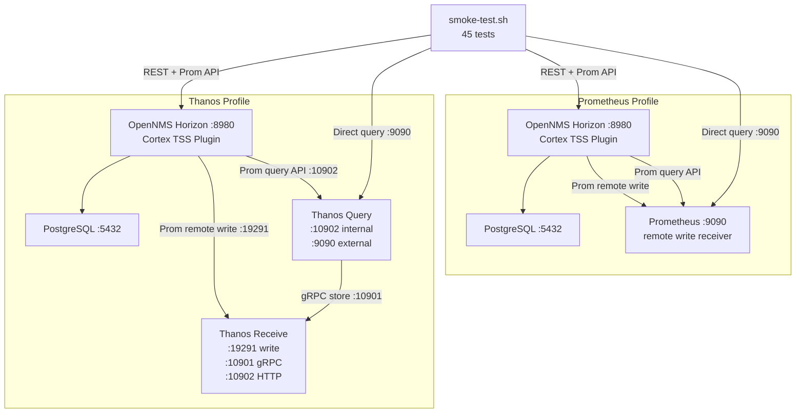

# End-to-End Test Harness

Docker/Podman Compose stack for testing the Cortex TSS plugin against OpenNMS Horizon with Prometheus-compatible backends.

## Architecture



Only run one profile at a time (they share host ports 8980, 9090, 5432).

## Backends

- **Prometheus** (`--profile prometheus`) -- vanilla Prometheus with `--web.enable-remote-write-receiver`. Gold standard: tests against the reference Prometheus API implementation.
- **Thanos** (`--profile thanos`) -- Thanos Receive + Query. Scale validation: tests against a production-realistic distributed backend with proper Thanos default ports (10902 HTTP, 10901 gRPC).

## Quick Start

1. Build the plugin and copy the KAR:

```bash
cd /path/to/opennms-cortex-tss-plugin
mvn clean install -DskipTests
cp assembly/kar/target/opennms-cortex-tss-plugin.kar e2e/opennms-overlay/deploy/
```

2. Start the stack with your chosen backend:

```bash
cd e2e
# Gold standard:
docker-compose --profile prometheus up -d

# Or scale validation:
docker-compose --profile thanos up -d
```

3. Wait for OpenNMS to initialize (~2 minutes with fast collection), then run the smoke tests:

```bash
./smoke-test.sh                      # auto-detects backend
./smoke-test.sh --backend prometheus # explicit
./smoke-test.sh --backend thanos     # explicit
```

## Smoke Tests

`smoke-test.sh` runs 45 tests across 12 sections, backend-agnostic:

| Section | Tests | What it validates |
|---------|-------|-------------------|
| 1. Plugin Lifecycle | 3 | Feature install, Karaf feature started, cortex config loaded |
| 2. Write Path | 4 | Metrics flowing, resourceIds, multiple resource types, write endpoint health |
| 3. Read Path | 4 | Query API, range queries, instant queries, exact resourceId match |
| 4. Meta Tags | 4 | Node/location/mtype labels written, values populated, tags on series, consistency |
| 5. Metric Sanitization | 3 | Prometheus-valid metric names, label names, no illegal characters |
| 6. Label Ordering | 1 | Labels lexicographically ordered per Prometheus convention |
| 7. Resource Discovery | 4 | /series wildcard, /label/resourceId/values, filtered match, field completeness |
| 8. Two-Phase Discovery | 4 | Label values matches wildcard, batched series, deduplication, empty filter |
| 9. OpenNMS REST API | 4 | Resource tree populated, child resources, graph attributes, multiple resource types |
| 10. Measurements API | 6 | Data retrieval, AVERAGE/MAX/MIN aggregation, response time, metadata |
| 11. Data Consistency | 3 | resourceId uniqueness, valid mtype values, series integrity |
| 12. Plugin Health | 5 | Write errors low, no exceptions, no pool exhaustion, feature registered, data fresh |

## Configuration

### Shared overlay (`opennms-overlay/`)

| File | Purpose |
|------|---------|
| `etc/opennms.properties.d/cortex.properties` | Enables `org.opennms.timeseries.strategy=integration` with meta tags |
| `etc/featuresBoot.d/cortex.boot` | Auto-installs the plugin feature from the deployed KAR |
| `etc/collectd-configuration.xml` | **30-second collection intervals** (vs default 5 min) for fast data generation |
| `etc/poller-configuration.xml` | **30-second polling intervals** with response time data for ICMP, HTTP, SSH |
| `deploy/opennms-cortex-tss-plugin.kar` | The plugin KAR file |

### Per-backend cortex plugin config

| File | Write URL | Read URL |
|------|-----------|----------|
| `opennms-overlay-prometheus/etc/org.opennms.plugins.tss.cortex.cfg` | `prometheus:9090/api/v1/write` | `prometheus:9090/api/v1` |
| `opennms-overlay-thanos/etc/org.opennms.plugins.tss.cortex.cfg` | `thanos-receive:19291/api/v1/receive` | `thanos-query:10902/api/v1` |

## Cleanup

```bash
# Stop containers and remove volumes (clean slate for next run)
docker-compose --profile prometheus down -v
# or
docker-compose --profile thanos down -v
```

## Port Reference

| Service | Internal Port | Host Port | Notes |
|---------|--------------|-----------|-------|
| OpenNMS Web/REST | 8980 | 8980 | Both profiles |
| OpenNMS Karaf SSH | 8101 | 8101 | Both profiles |
| PostgreSQL | 5432 | 5432 | Shared service |
| Prometheus HTTP | 9090 | 9090 | Prometheus profile only |
| Thanos Receive (write) | 19291 | 19291 | Thanos profile only |
| Thanos Receive (gRPC) | 10901 | 10901 | Thanos profile only |
| Thanos Receive (HTTP) | 10902 | 10902 | Thanos profile only |
| Thanos Query (HTTP) | 10902 | 9090 | Mapped to 9090 for smoke-test.sh compatibility |
